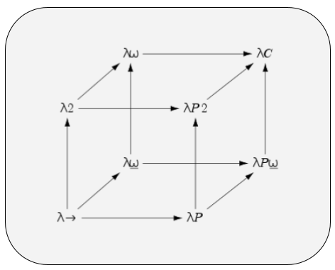

### Lambda Cube

This repository contains my implementation of calculi corresponding to the [**Lambda Cube**](https://en.wikipedia.org/wiki/Lambda_cube). The older JavaScript implementations, while full-featured, relied more on eval/apply operational semantics. The present revival is based on the more traditional syntactic rewriting approach. The overall aim of this project is to deeply explore the foundational aspects of logic, computation, plt, formal verification, type theory, category theory, functional programming, and compilers.

> foundations are always under construction

* Propositional Logic
  - [DPLL SAT Solver](https://github.com/archanpatkar/vostas)
* SKI Combinator Calculus
  - [Rewrite-based normalization](https://github.com/archanpatkar/lambdacube/blob/main/ski/rewrite.py)
  - [Stack-based normalization](https://github.com/archanpatkar/lambdacube/blob/main/ski/stack.py)
* (**λ**) Untyped Lambda Calculus - [Python](https://github.com/archanpatkar/lambdacube/blob/main/ulc) [JS](https://github.com/archanpatkar/ulc)
  - [α-conversion](https://github.com/archanpatkar/lambdacube/blob/main/ulc/lambda.py)
  - [de Bruijn representation](https://github.com/archanpatkar/lambdacube/blob/main/ulc/debruijn.py)
  - [Normalization by Evaluation (NbE)](https://github.com/archanpatkar/lambdacube/blob/main/ulc/nbe.py)
  - [Eval/apply operational semantics](https://github.com/archanpatkar/ulc/blob/master/src/eval.js) (old)
  - [Minimal core embedded in host language](https://github.com/archanpatkar/lambdacube/blob/main/coc/embedded/untyped.py)
* (**λ→**) Simply Typed Lambda Calculus - [JS](https://github.com/archanpatkar/styla)
  - [Church-style syntax directed type checker](https://github.com/archanpatkar/styla/blob/master/src/type.js) (old)
  - [Minimal core embedded in host language](https://github.com/archanpatkar/lambdacube/blob/main/coc/embedded/stlc.py)
* (**LLC**) Linear Lambda Calculus - [Python](https://github.com/archanpatkar/lambdacube/blob/main/llc/)
  - [Linearity-enforcing typechecker](https://github.com/archanpatkar/lambdacube/blob/main/llc/type.py)
    - de Bruijn-Peano core
    - explicit usage tracking
    - supports ⊗, ⊕, &, 1, ⊥, ⊤
* Restricted System F with Type Inference (*Hindley-Milner-Damas*) - [JS](https://github.com/archanpatkar/hml)
  - [Algorithm W](https://github.com/archanpatkar/hml/blob/master/src/type.js)
* (**λ2**) System F / Polymorphic Lambda Calculus - [JS](https://github.com/archanpatkar/systemF)
* (**Fω**) System F Omega / Higher-Order Polymorphic Lambda Calculus - [JS](https://github.com/archanpatkar/omega)
* (**MLTT**) Martin-Löf (dependent) type theory - [Python](https://github.com/archanpatkar/lambdacube/blob/main/mltt)
  - [Substitution, Type Inference](https://github.com/archanpatkar/lambdacube/blob/main/mltt/main.py)
  - [Normalization by Evaluation (NbE)](https://github.com/archanpatkar/lambdacube/blob/main/mltt/nbe.py)
* (**λC**) Calculus of constructions
  - [Minimal core embedded in host language](https://github.com/archanpatkar/lambdacube/blob/main/coc/embedded/dep.py)
* Non-Classical & Many-Valued Logics
  - (**K3**) [Kleene 3-valued logic](https://github.com/archanpatkar/tvl)
  - (**Gk**) [Gödel logics](https://github.com/archanpatkar/godel)
* Cellular Automata
  - [Universal 1D Cellular Automata Simulator](https://github.com/archanpatkar/lambdacube/blob/main/ca/sim.c)
    - General-purpose engine for Elementary Cellular Automata (ECA)
    - Minimalist rule-driven DSL
    - Dynamic bitvector-based simulation (C)
  - [Rule 110](https://github.com/archanpatkar/lambdacube/blob/main/ca/rule110.ca)
    - Turing-complete (Cook 2004)
  - [Rule 90](https://github.com/archanpatkar/lambdacube/blob/main/ca/rule110.ca)
    - Sierpiński fractal 
    - xor rules
* Other Formal Systems & Metalogic
  - [MIU Rule engine](https://github.com/archanpatkar/mure/tree/master)
    - from Hofstadter’s GEB

