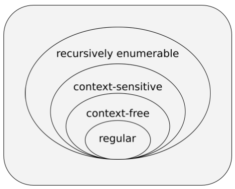
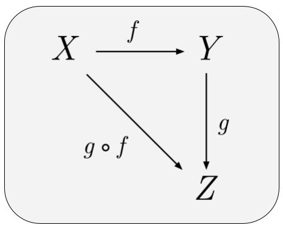

### Formal Systems Lab

This repository contains my implementation of calculi corresponding to the [**Lambda Cube**](https://en.wikipedia.org/wiki/Lambda_cube), and extends into the broader domain of formal systems. The current implementations emphasize traditional syntactic rewriting approaches, in contrast to my earlier eval/apply-style interpreters and semantics. The work explores connections between logic, computation, plt, formal verification, type theory, category theory, cellular automata, functional programming, and compiler construction. The scope ranges from elementary propositional logic to dependent type systems, non-classical logics, rewriting systems, and beyond.

> foundations are always under construction

* Propositional Logic
  - [DPLL SAT Solver](https://github.com/archanpatkar/vostas)
* SKI Combinator Calculus
  - [Rewrite-based normalization](https://github.com/archanpatkar/lambdacube/blob/main/ski/rewrite.py)
  - [Stack-based normalization](https://github.com/archanpatkar/lambdacube/blob/main/ski/stack.py)
* (**λ**) Untyped Lambda Calculus - [Python](https://github.com/archanpatkar/lambdacube/blob/main/ulc) [JS](https://github.com/archanpatkar/ulc)
  - [α-conversion](https://github.com/archanpatkar/lambdacube/blob/main/ulc/lambda.py)
  - [de Bruijn representation](https://github.com/archanpatkar/lambdacube/blob/main/ulc/debruijn.py)
  - [Normalization by Evaluation (NbE)](https://github.com/archanpatkar/lambdacube/blob/main/ulc/nbe.py)
  - [eval/apply operational semantics](https://github.com/archanpatkar/ulc/blob/master/src/eval.js) (old)
  - [Minimal core embedded in host language](https://github.com/archanpatkar/lambdacube/blob/main/coc/embedded/untyped.py)
* (**λ→**) Simply Typed Lambda Calculus - [JS](https://github.com/archanpatkar/styla)
  - [Church-style syntax directed type checker](https://github.com/archanpatkar/styla/blob/master/src/type.js) (old)
  - [Minimal core embedded in host language](https://github.com/archanpatkar/lambdacube/blob/main/coc/embedded/stlc.py)
* (**LLC**) Linear Lambda Calculus - [Python](https://github.com/archanpatkar/lambdacube/blob/main/llc/)
  - [Linearity-enforcing typechecker](https://github.com/archanpatkar/lambdacube/blob/main/llc/type.py)
    - de Bruijn-Peano core
    - explicit usage tracking
    - supports ⊗, ⊕, &, 1, ⊥, ⊤
* Restricted System F with Type Inference (*Hindley-Milner-Damas*) - [JS](https://github.com/archanpatkar/hml)
  - [Algorithm W](https://github.com/archanpatkar/hml/blob/master/src/type.js)
* (**λ2**) System F / Polymorphic Lambda Calculus - [JS](https://github.com/archanpatkar/systemF)
* (**Fω**) System F Omega / Higher-Order Polymorphic Lambda Calculus - [JS](https://github.com/archanpatkar/omega)
* (**MLTT**) Martin-Löf (dependent) type theory - [Python](https://github.com/archanpatkar/lambdacube/blob/main/mltt)
  - [Substitution, Type Inference](https://github.com/archanpatkar/lambdacube/blob/main/mltt/main.py)
  - [Normalization by Evaluation (NbE)](https://github.com/archanpatkar/lambdacube/blob/main/mltt/nbe.py)
* (**λC**) Calculus of constructions
  - [Minimal core embedded in host language](https://github.com/archanpatkar/lambdacube/blob/main/coc/embedded/dep.py)
* Tree Calculus
  - [Branch-first evaluator](https://github.com/archanpatkar/lambdacube/blob/main/tree/bfeval/src/index.js)
    - parsimonious, Turing-complete system
    - computaion via tree rewriting
    - has reflective capability
* Non-Classical & Many-Valued Logics
  - (**K3**) [Kleene 3-valued logic](https://github.com/archanpatkar/tvl)
  - (**Gk**) [Gödel logics](https://github.com/archanpatkar/godel)
* Cellular Automata
  - [Universal 1D Cellular Automata Simulator](https://github.com/archanpatkar/lambdacube/blob/main/ca/sim.c)
    - General-purpose engine for Elementary Cellular Automata (ECA)
    - Minimalist rule-driven DSL
    - Dynamic bitvector-based simulation (C)
  - [Rule 110](https://github.com/archanpatkar/lambdacube/blob/main/ca/rule110.ca)
    - Turing-complete (Cook 2004)
  - [Rule 90](https://github.com/archanpatkar/lambdacube/blob/main/ca/rule90.ca)
    - Sierpiński fractal 
    - xor rules
* Other Formal Systems & Metalogic
  - [MIU Rule engine](https://github.com/archanpatkar/mure/tree/master)
    - from Hofstadter’s GEB
    - semi-code golf implementation
    - includes lazy generator for stepwise derivations
  - [Bags & Bundles (NBE)](https://github.com/archanpatkar/lambdacube/blob/main/misc/elementary_nbe.js)
    - based on Oleg Kiselyov’s tiny symbolic game
    - semantic model: total shell count

#### Image Credits
1. [Lambda Cube](https://github.com/archanpatkar/formal/blob/main/LambdaCube.png) by <a href="//commons.wikimedia.org/w/index.php?title=User:Tellofou&amp;action=edit&amp;redlink=1" class="new" title="User:Tellofou (page does not exist)">Tellofou</a> - Own work, <a href="https://creativecommons.org/licenses/by-sa/4.0" title="Creative Commons Attribution-Share Alike 4.0">CC BY-SA 4.0</a>, <a href="https://commons.wikimedia.org/w/index.php?curid=76344034">Link</a>
2. [Chomsky Hierarchy](https://github.com/archanpatkar/formal/blob/main/ChomskyHierarchy.png) by <a href="//commons.wikimedia.org/wiki/User:J._Finkelstein" title="User:J. Finkelstein">J. Finkelstein</a> - Own work, <a href="https://creativecommons.org/licenses/by-sa/3.0" title="Creative Commons Attribution-Share Alike 3.0">CC BY-SA 3.0</a>, <a href="https://commons.wikimedia.org/w/index.php?curid=9405226">Link</a>
3. [Category Theory](https://github.com/archanpatkar/formal/blob/main/CategoryTheory.png) by <a href="//commons.wikimedia.org/w/index.php?title=User:Cepheus&amp;action=edit&amp;redlink=1" class="new" title="User:Cepheus (page does not exist)">User:Cepheus</a> - Own work, based on <a href="https://en.wikipedia.org/wiki/Image:MorphismComposition-01.png" class="extiw" title="en:Image:MorphismComposition-01.png">en:Image:MorphismComposition-01.png</a>, Public Domain, <a href="https://commons.wikimedia.org/w/index.php?curid=1425613">Link</a>
